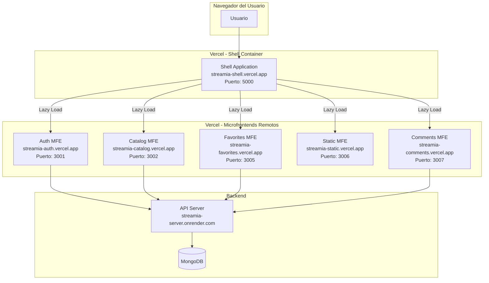
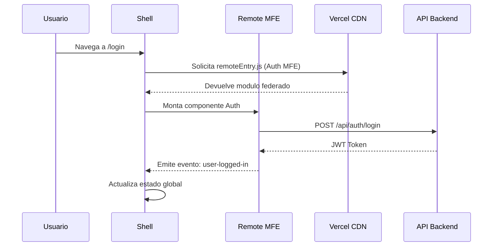
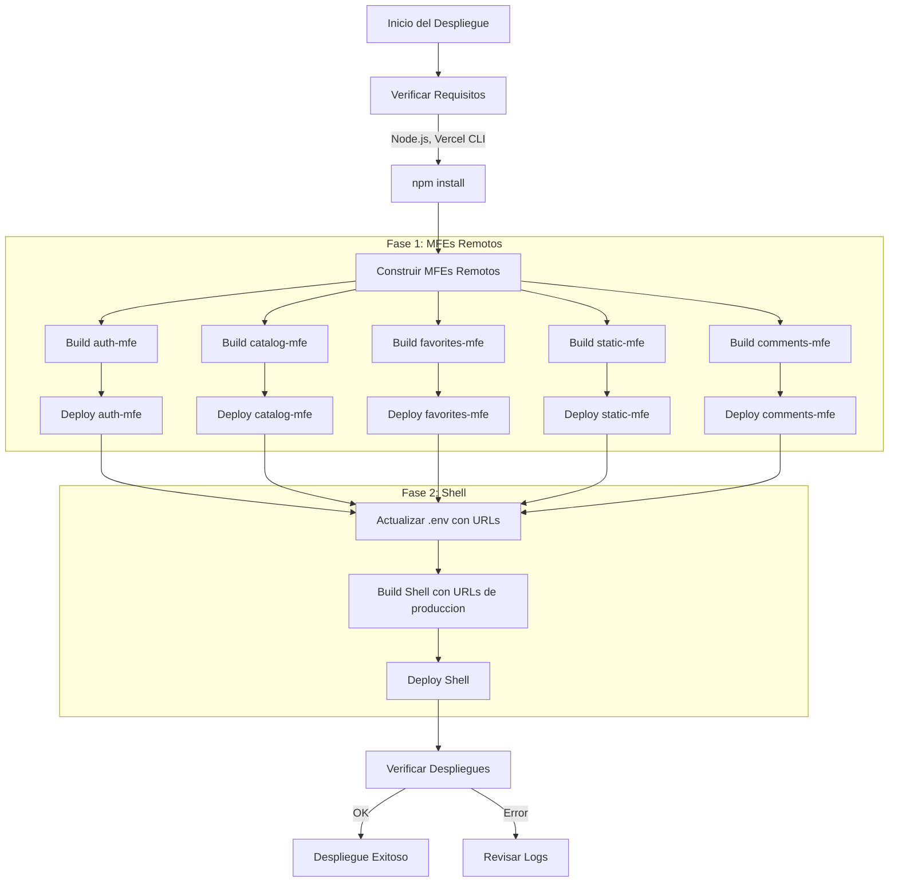
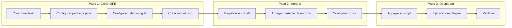
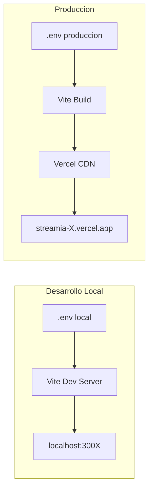
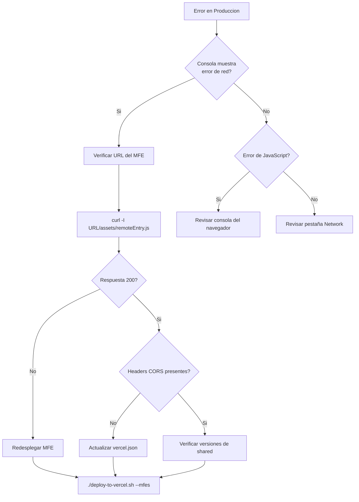

# Guia de Despliegue - Streamia Microfrontends

## Tabla de Contenidos

1. [Arquitectura de Despliegue](#arquitectura-de-despliegue)
2. [Estructura del Proyecto](#estructura-del-proyecto)
3. [Flujo de Despliegue](#flujo-de-despliegue)
4. [Configuracion de Microfrontends](#configuracion-de-microfrontends)
5. [Agregar un Nuevo Microfrontend](#agregar-un-nuevo-microfrontend)
6. [Variables de Entorno](#variables-de-entorno)
7. [Troubleshooting](#troubleshooting)

---

## Arquitectura de Despliegue

La arquitectura de Streamia utiliza Module Federation de Webpack/Vite para implementar microfrontends. Cada MFE se despliega de forma independiente en Vercel y el Shell (aplicacion contenedora) los consume en tiempo de ejecucion.



### Comunicacion entre Componentes



---

## Estructura del Proyecto

```
streamia/
├── .env                          # Variables de entorno (produccion)
├── .env.example                  # Plantilla de variables
├── package.json                  # Configuracion del monorepo
├── deploy-to-vercel.sh           # Script de despliegue automatizado
│
└── packages/
    ├── shared/                   # Codigo compartido entre MFEs
    │   ├── src/
    │   │   ├── components/       # Componentes reutilizables
    │   │   ├── config/           # Configuracion global
    │   │   ├── events/           # Sistema de eventos
    │   │   ├── styles/           # Estilos compartidos
    │   │   ├── types/            # Tipos TypeScript
    │   │   └── utils/            # Utilidades
    │   └── package.json
    │
    ├── shell/                    # Aplicacion contenedora (Host)
    │   ├── src/
    │   │   ├── router/           # Rutas de la aplicacion
    │   │   ├── components/       # Layout, ErrorBoundary, etc.
    │   │   └── store/            # Estado global compartido
    │   ├── vite.config.ts        # Configuracion de Federation (Host)
    │   └── vercel.json           # Configuracion de Vercel
    │
    ├── auth-mfe/                 # Microfrontend de autenticacion
    │   ├── src/
    │   ├── vite.config.ts        # Configuracion de Federation (Remote)
    │   └── vercel.json           # Configuracion de CORS
    │
    ├── catalog-mfe/              # Microfrontend de catalogo
    ├── favorites-mfe/            # Microfrontend de favoritos
    ├── static-mfe/               # Microfrontend de paginas estaticas
    └── comments-mfe/             # Microfrontend de comentarios
```

---

## Flujo de Despliegue

El despliegue sigue un orden especifico para garantizar que las dependencias esten disponibles.



### Comandos de Despliegue

```bash
# Despliegue completo
./deploy-to-vercel.sh --all

# Solo MFEs remotos
./deploy-to-vercel.sh --mfes

# Solo Shell
./deploy-to-vercel.sh --shell
```

---

## Configuracion de Microfrontends

### Configuracion del Host (Shell)

El Shell actua como Host en Module Federation y consume los MFEs remotos.

**Archivo: `packages/shell/vite.config.ts`**

```typescript
import { defineConfig, loadEnv } from 'vite';
import federation from '@originjs/vite-plugin-federation';

export default defineConfig(({ mode }) => {
  const env = loadEnv(mode, path.resolve(__dirname, '../..'), '');
  
  return {
    plugins: [
      federation({
        name: 'shell',
        remotes: {
          // Cada MFE remoto se registra aqui
          authMFE: env.VITE_AUTH_MFE_URL || 'http://localhost:3001/assets/remoteEntry.js',
          catalogMFE: env.VITE_CATALOG_MFE_URL || 'http://localhost:3002/assets/remoteEntry.js',
          // ... otros MFEs
        },
        shared: {
          react: '^19.2.0',
          'react-dom': '^19.2.0',
          'react-router-dom': '^7.9.4',
        },
      }),
    ],
  };
});
```

### Configuracion de un Remote (MFE)

Cada MFE expone sus componentes para ser consumidos por el Shell.

**Archivo: `packages/[mfe-name]/vite.config.ts`**

```typescript
import { defineConfig } from 'vite';
import federation from '@originjs/vite-plugin-federation';

export default defineConfig({
  plugins: [
    federation({
      name: 'nombreMFE',           // Nombre unico del MFE
      filename: 'remoteEntry.js',  // Archivo de entrada
      exposes: {
        './App': './src/App',      // Componentes expuestos
      },
      shared: {
        react: { singleton: true, requiredVersion: '^19.2.0' },
        'react-dom': { singleton: true, requiredVersion: '^19.2.0' },
        'react-router-dom': { singleton: true, requiredVersion: '^7.9.4' },
      },
    }),
  ],
  server: {
    port: 300X,  // Puerto unico para desarrollo
    cors: true,
  },
});
```

### Configuracion de Vercel (CORS)

**Archivo: `packages/[mfe-name]/vercel.json`**

```json
{
  "headers": [
    {
      "source": "/(.*)",
      "headers": [
        { "key": "Access-Control-Allow-Origin", "value": "*" },
        { "key": "Access-Control-Allow-Methods", "value": "GET, OPTIONS" },
        { "key": "Access-Control-Allow-Headers", "value": "Content-Type" }
      ]
    }
  ],
  "rewrites": [
    { "source": "/(.*)", "destination": "/index.html" }
  ]
}
```

---

## Agregar un Nuevo Microfrontend

### Diagrama del Proceso



### Paso 1: Crear la Estructura del MFE

#### 1.1 Crear el directorio

```bash
mkdir -p packages/nuevo-mfe/src
cd packages/nuevo-mfe
```

#### 1.2 Crear package.json

```json
{
  "name": "@streamia/nuevo-mfe",
  "version": "1.0.0",
  "type": "module",
  "scripts": {
    "dev": "vite --port 3008",
    "build": "vite build",
    "preview": "vite preview --port 3008"
  },
  "dependencies": {
    "react": "^19.2.0",
    "react-dom": "^19.2.0",
    "react-router-dom": "^7.9.4",
    "@streamia/shared": "file:../shared"
  },
  "devDependencies": {
    "@originjs/vite-plugin-federation": "^1.3.5",
    "@vitejs/plugin-react": "^4.3.4",
    "typescript": "^5.9.3",
    "vite": "^7.1.9",
    "sass": "^1.93.2"
  }
}
```

#### 1.3 Crear vite.config.ts

```typescript
import { defineConfig } from 'vite';
import react from '@vitejs/plugin-react';
import federation from '@originjs/vite-plugin-federation';
import path from 'path';

export default defineConfig({
  envDir: path.resolve(__dirname, '../..'),
  plugins: [
    react(),
    federation({
      name: 'nuevoMFE',
      filename: 'remoteEntry.js',
      exposes: {
        './App': './src/App.tsx',
      },
      shared: {
        react: { singleton: true, requiredVersion: '^19.2.0' },
        'react-dom': { singleton: true, requiredVersion: '^19.2.0' },
        'react-router-dom': { singleton: true, requiredVersion: '^7.9.4' },
      },
    }),
  ],
  resolve: {
    alias: {
      '@streamia/shared': path.resolve(__dirname, '../shared/src'),
    },
  },
  server: {
    port: 3008,
    cors: true,
  },
  build: {
    target: 'esnext',
    minify: 'esbuild',
    cssCodeSplit: false,
    modulePreload: false,
    rollupOptions: {
      output: {
        format: 'esm',
      },
    },
  },
});
```

#### 1.4 Crear vercel.json

```json
{
  "headers": [
    {
      "source": "/(.*)",
      "headers": [
        { "key": "Access-Control-Allow-Origin", "value": "*" },
        { "key": "Access-Control-Allow-Methods", "value": "GET, OPTIONS" },
        { "key": "Access-Control-Allow-Headers", "value": "Content-Type" }
      ]
    }
  ],
  "rewrites": [
    { "source": "/(.*)", "destination": "/index.html" }
  ]
}
```

#### 1.5 Crear el componente principal

**Archivo: `src/App.tsx`**

```typescript
import { useLocation } from 'react-router-dom';

function App() {
  const location = useLocation();
  
  return (
    <div className="nuevo-mfe">
      <h1>Nuevo MFE</h1>
      <p>Ruta actual: {location.pathname}</p>
    </div>
  );
}

export default App;
```

**Archivo: `src/main.tsx`**

```typescript
import { StrictMode } from 'react';
import { createRoot } from 'react-dom/client';
import { BrowserRouter } from 'react-router-dom';
import App from './App';

const root = document.getElementById('root');
if (root) {
  createRoot(root).render(
    <StrictMode>
      <BrowserRouter>
        <App />
      </BrowserRouter>
    </StrictMode>
  );
}
```

### Paso 2: Integrar con el Shell

#### 2.1 Registrar el MFE en el Shell

**Archivo: `packages/shell/vite.config.ts`**

Agregar el nuevo remote:

```typescript
remotes: {
  authMFE: env.VITE_AUTH_MFE_URL || 'http://localhost:3001/assets/remoteEntry.js',
  catalogMFE: env.VITE_CATALOG_MFE_URL || 'http://localhost:3002/assets/remoteEntry.js',
  // ... otros MFEs existentes
  nuevoMFE: env.VITE_NUEVO_MFE_URL || 'http://localhost:3008/assets/remoteEntry.js',  // NUEVO
},
```

#### 2.2 Declarar tipos TypeScript

**Archivo: `packages/shell/src/vite-env.d.ts`**

Agregar la declaracion del modulo:

```typescript
declare module 'nuevoMFE/App' {
  const App: React.ComponentType;
  export default App;
}
```

Y la variable de entorno:

```typescript
interface ImportMetaEnv {
  readonly VITE_NUEVO_MFE_URL?: string;
  // ... otras variables
}
```

#### 2.3 Configurar las rutas

**Archivo: `packages/shell/src/router/AppRouter.tsx`**

```typescript
// Importar el nuevo MFE
const NuevoMFE = loadMicrofrontend(
  () => import('nuevoMFE/App'),
  'Nuevo MFE'
);

// Agregar la ruta
<Route path="/nuevo/*" element={<NuevoMFE />} />
```

#### 2.4 Agregar variable de entorno

**Archivo: `.env.example`**

```bash
VITE_NUEVO_MFE_URL=https://streamia-nuevo.vercel.app/assets/remoteEntry.js
```

### Paso 3: Configurar el Despliegue

#### 3.1 Agregar al script de despliegue

**Archivo: `deploy-to-vercel.sh`**

Agregar a la lista de proyectos:

```bash
declare -A MFE_PROJECTS=(
    ["auth-mfe"]="streamia-auth"
    ["catalog-mfe"]="streamia-catalog"
    ["favorites-mfe"]="streamia-favorites"
    ["static-mfe"]="streamia-static"
    ["comments-mfe"]="streamia-comments"
    ["nuevo-mfe"]="streamia-nuevo"    # NUEVO
)
```

Actualizar la funcion `update_env_file`:

```bash
VITE_NUEVO_MFE_URL=https://streamia-nuevo.vercel.app/assets/remoteEntry.js
```

#### 3.2 Agregar al script de desarrollo

**Archivo: `start-dev.sh`**

```bash
declare -a MFE_CONFIGS=(
    "Auth MFE:auth-mfe:3001"
    "Catalog MFE:catalog-mfe:3002"
    "Favorites MFE:favorites-mfe:3005"
    "Static MFE:static-mfe:3006"
    "Comments MFE:comments-mfe:3007"
    "Nuevo MFE:nuevo-mfe:3008"    # NUEVO
)
```

### Paso 4: Desplegar

```bash
# Instalar dependencias del nuevo MFE
npm install

# Ejecutar despliegue completo
./deploy-to-vercel.sh --all
```

---

## Variables de Entorno

### Tabla de Variables

| Variable | Descripcion | Ejemplo |
|----------|-------------|---------|
| `VITE_API_URL` | URL del backend API | `https://streamia-server.onrender.com/api` |
| `VITE_AUTH_MFE_URL` | URL del remoteEntry de Auth | `https://streamia-auth.vercel.app/assets/remoteEntry.js` |
| `VITE_CATALOG_MFE_URL` | URL del remoteEntry de Catalog | `https://streamia-catalog.vercel.app/assets/remoteEntry.js` |
| `VITE_FAVORITES_MFE_URL` | URL del remoteEntry de Favorites | `https://streamia-favorites.vercel.app/assets/remoteEntry.js` |
| `VITE_STATIC_MFE_URL` | URL del remoteEntry de Static | `https://streamia-static.vercel.app/assets/remoteEntry.js` |
| `VITE_COMMENTS_MFE_URL` | URL del remoteEntry de Comments | `https://streamia-comments.vercel.app/assets/remoteEntry.js` |

### Flujo de Variables



---

## Troubleshooting

### Error: Failed to fetch dynamically imported module

**Causa**: El Shell no puede cargar el `remoteEntry.js` de un MFE.

**Solucion**:
1. Verificar que el MFE este desplegado
2. Verificar la URL en las variables de entorno
3. Verificar headers CORS

```bash
curl -I https://streamia-[mfe].vercel.app/assets/remoteEntry.js
```

### Error: CORS blocked

**Causa**: Headers CORS no configurados.

**Solucion**: Verificar `vercel.json` del MFE:

```json
{
  "headers": [
    {
      "source": "/(.*)",
      "headers": [
        { "key": "Access-Control-Allow-Origin", "value": "*" }
      ]
    }
  ]
}
```

### Error: Shared module version mismatch

**Causa**: Versiones diferentes de React entre MFEs.

**Solucion**: Asegurar que todos los MFEs usen las mismas versiones en `shared`:

```typescript
shared: {
  react: { singleton: true, requiredVersion: '^19.2.0' },
  'react-dom': { singleton: true, requiredVersion: '^19.2.0' },
}
```

### Diagrama de Diagnostico



---

## Referencias

- [Vite Plugin Federation](https://github.com/originjs/vite-plugin-federation)
- [Module Federation](https://webpack.js.org/concepts/module-federation/)
- [Vercel Documentation](https://vercel.com/docs)
- [React Router](https://reactrouter.com/)
