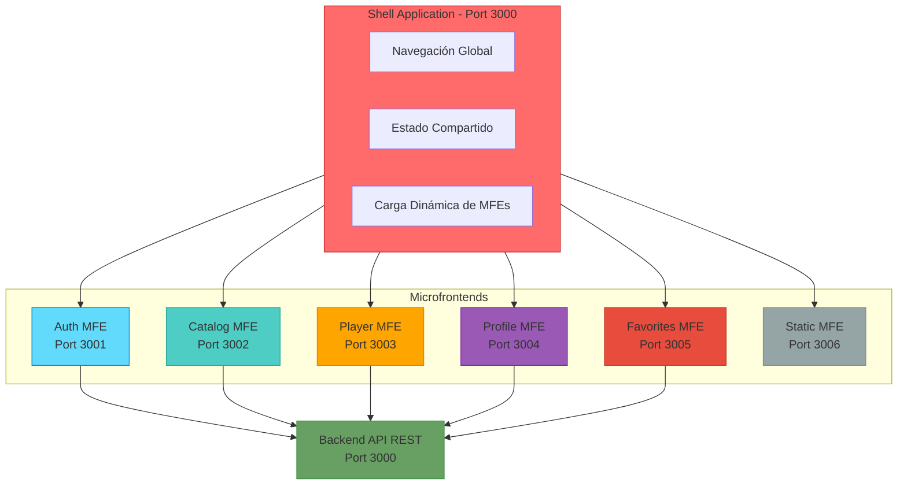
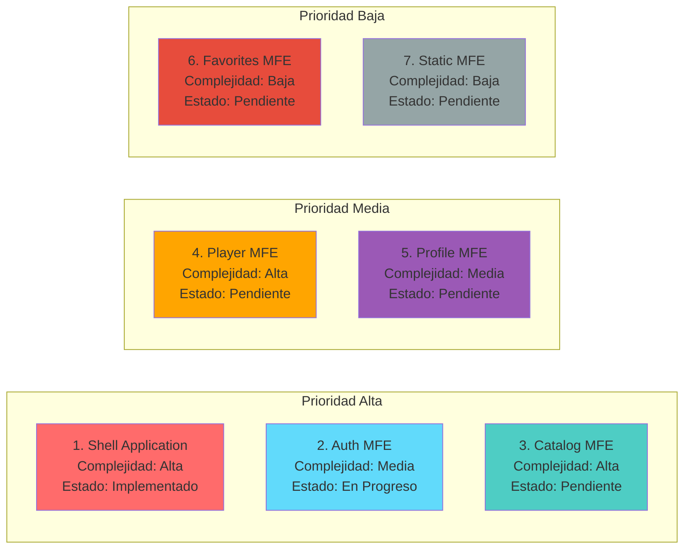
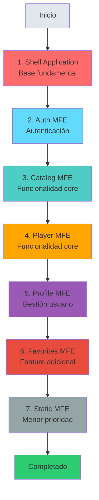

# Microfrontends Pendientes - STREAMIA

## Resumen

Este documento lista los **7 microfrontends** que componen la arquitectura de STREAMIA, su estructura y estado de implementación.

---

## Arquitectura General



---

## Microfrontends por Implementar

### Estado de Implementación



---

## 1. Shell Application (Contenedor)

### Responsabilidad
Orquestador principal que carga y coordina todos los microfrontends.

### Estructura
```
packages/shell/
├── src/
│   ├── App.tsx                    # App principal
│   ├── main.tsx                   # Entry point
│   ├── components/
│   │   ├── Layout.tsx             # Layout global
│   │   ├── NavBar.tsx             # Navegación
│   │   ├── Footer.tsx             # Footer
│   │   ├── ErrorBoundary.tsx      # Manejo de errores
│   │   ├── ProtectedRoute.tsx     # Rutas protegidas
│   │   └── LoadingSpinner.tsx     # Loading state
│   ├── router/
│   │   └── AppRouter.tsx          # Router principal
│   ├── store/
│   │   └── SharedStore.tsx        # Estado compartido (Context API)
│   ├── config/
│   │   └── microfrontends.ts      # Configuración de MFEs
│   ├── pages/
│   └── styles/
├── vite.config.ts                  # Incluye Module Federation
├── index.html
└── package.json
```

### Funcionalidades
- Navegación global (NavBar, Footer)
- Carga dinámica de microfrontends vía Module Federation
- Gestión de estado compartido (autenticación)
- Sistema de eventos (EventBus desde @streamia/shared)
- Manejo de errores global (ErrorBoundary)
- Routing principal con React Router v7
- Rutas protegidas (ProtectedRoute)

### Configuración Module Federation
- **Puerto:** 3000
- **Remotes:** authMFE (localhost:3001)
- **Shared:** React, React-DOM, React-Router-DOM

---

## 2. Auth Microfrontend

### Responsabilidad
Autenticación y autorización de usuarios.

### Estructura
```
packages/auth-mfe/
├── src/
│   ├── App.tsx
│   ├── main.tsx
│   ├── pages/                      # Por implementar
│   │   ├── LoginPage.tsx           # TODO
│   │   ├── RegisterPage.tsx        # TODO
│   │   ├── RecoverPasswordPage.tsx # TODO
│   │   └── ResetPasswordPage.tsx   # TODO
│   ├── components/                 # Implementado
│   │   ├── LoginForm/
│   │   │   ├── LoginForm.tsx
│   │   │   └── LoginForm.scss
│   │   └── RegisterForm/
│   │       ├── RegisterForm.tsx
│   │       └── RegisterForm.scss
│   ├── services/
│   │   └── authService.ts          # Implementado
│   ├── schemas/
│   │   └── authSchemas.ts          # Validaciones Zod
│   └── styles/                     # Implementado
├── vite.config.ts                  # Con Module Federation
├── index.html
└── package.json
```

### Rutas
- `/login` - Inicio de sesión
- `/register` - Registro de usuario
- `/recover-password` - Recuperar contraseña
- `/reset-password/:token` - Resetear contraseña

### API Endpoints
- `POST /api/users/register`
- `POST /api/users/login`
- `POST /api/users/forgot-password`
- `POST /api/users/reset-password`

### Validación
- Zod schemas para formularios (authSchemas.ts)
- Validación cliente con React Hook Form (pendiente)

### Eventos Emitidos
- `user:login` - Usuario inició sesión `{token, user}`
- `user:register` - Usuario registrado

### Configuración Module Federation
- **Puerto:** 3001
- **Exposes:** `./App`
- **Shared:** React, React-DOM, React-Router-DOM

---

## 3. Catalog Microfrontend

### Responsabilidad
Catálogo, búsqueda y filtrado de películas.

### Estructura
```
packages/catalog-mfe/
├── src/
│   ├── App.tsx
│   ├── main.tsx
│   ├── pages/
│   │   ├── MoviesListPage.tsx
│   │   └── HomeMoviesPage.tsx
│   ├── components/
│   │   ├── MovieCard.tsx
│   │   ├── MovieCarousel.tsx
│   │   ├── MovieGrid.tsx
│   │   ├── SearchBar.tsx
│   │   ├── FilterPanel.tsx
│   │   └── CategorySelector.tsx
│   ├── services/
│   │   ├── movieService.ts
│   │   └── favoritesService.ts
│   ├── hooks/
│   │   ├── useMovies.ts
│   │   └── useFilters.ts
│   ├── types/
│   │   └── movie.types.ts
│   └── styles/
├── vite.config.ts                  # Con Module Federation
├── index.html
└── package.json
```

### Rutas
- `/movies` - Catálogo completo
- `/home-movies` - Página principal de películas

### Configuración Module Federation
- **Puerto:** 3002
- **Exposes:** `./App`
- **Shared:** React, React-DOM, React-Router-DOM

### API Endpoints
- `GET /api/movies` - Listar películas
- `GET /api/movies?category={category}` - Filtrar por categoría
- `POST /api/favorites` - Añadir favorito (quick action)
- `DELETE /api/favorites/:movieId` - Remover favorito

### Eventos
**Emitidos:**
- `favorite:added` - Favorito añadido `{movieId}`
- `movie:selected` - Película seleccionada

**Escuchados:**
- `user:authenticated` - Usuario autenticado
- `favorite:removed` - Favorito eliminado (actualizar UI)

---

## 4. Player Microfrontend

### Responsabilidad
Reproducción de películas, comentarios y calificaciones.

### Estructura
```
packages/player-mfe/
├── src/
│   ├── App.tsx
│   ├── pages/
│   │   └── MovieDetailPage.tsx
│   ├── components/
│   │   ├── VideoPlayer.tsx
│   │   ├── MovieInfo.tsx
│   │   ├── CommentSection.tsx
│   │   ├── CommentCard.tsx
│   │   ├── CommentForm.tsx
│   │   ├── RatingWidget.tsx
│   │   ├── RatingStars.tsx
│   │   └── SubtitleSelector.tsx
│   ├── services/
│   │   ├── movieService.ts
│   │   ├── commentService.ts
│   │   └── ratingService.ts
│   ├── hooks/
│   │   ├── useMovieDetail.ts
│   │   ├── useComments.ts
│   │   └── useRating.ts
│   ├── types/
│   │   └── player.types.ts
│   └── styles/
├── vite.config.ts                  # Con Module Federation
├── index.html
└── package.json
```

### Rutas
- `/movie/:id` - Detalle y reproducción

### Configuración Module Federation
- **Puerto:** 3003
- **Exposes:** `./App`
- **Shared:** React, React-DOM, React-Router-DOM

### API Endpoints
- `GET /api/movies/:id` - Obtener película
- `GET /api/comments/movie/:movieId` - Listar comentarios
- `POST /api/comments` - Crear comentario
- `PUT /api/comments/:id` - Editar comentario
- `DELETE /api/comments/:id` - Eliminar comentario
- `GET /api/ratings/movie/:movieId` - Obtener calificación
- `POST /api/ratings` - Crear/actualizar calificación
- `DELETE /api/ratings/:movieId` - Eliminar calificación

### Eventos
**Emitidos:**
- `favorite:added` - Favorito añadido
- `rating:updated` - Calificación actualizada

**Escuchados:**
- `user:authenticated` - Usuario autenticado

---

## 5. Profile Microfrontend

### Responsabilidad
Gestión de perfil de usuario.

### Estructura
```
packages/profile-mfe/
├── src/
│   ├── App.tsx
│   ├── pages/
│   │   ├── ProfilePage.tsx
│   │   └── EditProfilePage.tsx
│   ├── components/
│   │   ├── ProfileView.tsx
│   │   ├── EditProfileForm.tsx
│   │   ├── ChangePasswordForm.tsx
│   │   ├── DeleteAccountModal.tsx
│   │   └── ProfileStats.tsx
│   ├── services/
│   │   └── userService.ts
│   ├── hooks/
│   │   └── useProfile.ts
│   ├── types/
│   │   └── profile.types.ts
│   └── styles/
├── vite.config.ts                  # Con Module Federation
├── index.html
└── package.json
```

### Rutas
- `/profile` - Ver perfil
- `/edit-profile` - Editar perfil

### Configuración Module Federation
- **Puerto:** 3004
- **Exposes:** `./App`
- **Shared:** React, React-DOM, React-Router-DOM

### API Endpoints
- `GET /api/users/profile` - Obtener perfil
- `PUT /api/users/profile` - Actualizar perfil
- `DELETE /api/users/profile` - Eliminar cuenta

### Eventos
**Emitidos:**
- `user:updated` - Perfil actualizado `{user}`
- `user:deleted` - Cuenta eliminada

**Escuchados:**
- `user:authenticated` - Usuario autenticado

---

## 6. Favorites Microfrontend

### Responsabilidad
Gestión de películas favoritas.

### Estructura
```
packages/favorites-mfe/
├── src/
│   ├── App.tsx
│   ├── pages/
│   │   └── FavoritesPage.tsx
│   ├── components/
│   │   ├── FavoritesList.tsx
│   │   ├── FavoriteCard.tsx
│   │   └── EmptyFavorites.tsx
│   ├── services/
│   │   └── favoritesService.ts
│   ├── hooks/
│   │   └── useFavorites.ts
│   ├── types/
│   │   └── favorites.types.ts
│   └── styles/
├── vite.config.ts                  # Con Module Federation
├── index.html
└── package.json
```

### Rutas
- `/favorites` - Lista de favoritos

### Configuración Module Federation
- **Puerto:** 3005
- **Exposes:** `./App`
- **Shared:** React, React-DOM, React-Router-DOM

### API Endpoints
- `GET /api/favorites` - Listar favoritos
- `DELETE /api/favorites/:movieId` - Remover favorito
- `GET /api/favorites/check/:movieId` - Verificar si es favorito

### Eventos
**Emitidos:**
- `favorite:removed` - Favorito eliminado `{movieId}`

**Escuchados:**
- `user:authenticated` - Usuario autenticado
- `favorite:added` - Favorito añadido (actualizar lista)

---

## 7. Static Pages Microfrontend

### Responsabilidad
Páginas estáticas e informativas.

### Estructura
```
packages/static-mfe/
├── src/
│   ├── App.tsx
│   ├── pages/
│   │   ├── HomePage.tsx          # Landing page
│   │   ├── AboutPage.tsx
│   │   ├── ContactPage.tsx
│   │   ├── ManualPage.tsx
│   │   └── SitemapPage.tsx
│   ├── components/
│   │   ├── Hero.tsx
│   │   ├── Features.tsx
│   │   ├── ContactForm.tsx
│   │   └── BreadcrumbNav.tsx
│   ├── types/
│   │   └── static.types.ts
│   └── styles/
├── vite.config.ts                  # Con Module Federation
├── index.html
└── package.json
```

### Rutas
- `/` - Landing page
- `/home` - Página principal
- `/about` - Acerca de
- `/contact` - Contacto
- `/manual` - Manual de usuario
- `/sitemap` - Mapa del sitio

### API Endpoints
- Ninguno (o `POST /api/contact` si se implementa)

### Configuración Module Federation
- **Puerto:** 3006
- **Exposes:** `./App`
- **Shared:** React, React-DOM, React-Router-DOM

---

## Sistema de Comunicación

### EventBus Compartido

Los microfrontends se comunican mediante un **EventBus** centralizado:

```typescript
// Publicar evento
eventBus.publish('user:login', { token, user });

// Suscribirse a evento
eventBus.subscribe('user:logout', () => {
  // Limpiar estado local
});
```

### Eventos Principales

| Evento | Emisor | Receptor | Datos |
|--------|--------|----------|-------|
| `user:login` | Auth MFE | Shell, Todos | `{token, user}` |
| `user:logout` | Shell | Todos | - |
| `user:updated` | Profile MFE | Shell, Auth | `{user}` |
| `user:deleted` | Profile MFE | Shell | - |
| `favorite:added` | Catalog, Player | Favorites | `{movieId}` |
| `favorite:removed` | Favorites, Catalog | Todos | `{movieId}` |
| `route:change` | Shell | Todos | `{path}` |

---

## Estructura del Monorepo

```
streamia/
├── packages/
│   ├── shell/                    # Implementado
│   ├── auth-mfe/                 # En Progreso (falta pages/)
│   ├── catalog-mfe/              # Pendiente
│   ├── player-mfe/               # Pendiente
│   ├── profile-mfe/              # Pendiente
│   ├── favorites-mfe/            # Pendiente
│   ├── static-mfe/               # Pendiente
│   └── shared/                   # Implementado
│       ├── components/           # Componentes compartidos
│       ├── utils/                # logger, tokenManager
│       ├── types/                # Tipos TypeScript
│       ├── events/               # EventBus
│       └── styles/               # Variables, mixins, globals
├── package.json                  # npm workspaces
├── README.md
└── MICROFRONTENDS-PENDIENTES.md
```

---

## Dependencias Compartidas

Todas las microfrontends comparten:

- **React** 19.2.0
- **React DOM** 19.2.0
- **React Router DOM** 7.9.4
- **TypeScript** ~5.9.3
- **Vite** 7.1.9
- **Sass** 1.93.2
- **Zod** ^3.22.4 (validación)
- **@originjs/vite-plugin-federation** 1.3.5
- **Lucide React** (iconos)

---

## Orden de Implementación Recomendado



---

## Métricas de Éxito

- Cada MFE se puede desarrollar independientemente
- Cada MFE se puede desplegar independientemente
- Build time < 30s por microfrontend
- Tamaño de bundle < 200KB por MFE (gzipped)
- Time to Interactive < 3s
- No hay dependencias circulares entre MFEs

---

## Tareas Pendientes

### Auth MFE (Completar)
- [ ] Crear páginas en `pages/` (LoginPage, RegisterPage, etc.)
- [ ] Migrar lógica de componentes a páginas
- [ ] Implementar tipos específicos en `types/auth.types.ts`
- [ ] Añadir manejo de errores mejorado

### Catalog MFE
- [ ] Crear estructura completa del paquete
- [ ] Implementar componentes (MovieCard, Grid, Carousel)
- [ ] Integrar con API de películas
- [ ] Configurar Module Federation (puerto 3002)

### Player MFE
- [ ] Crear estructura completa del paquete
- [ ] Implementar reproductor de video
- [ ] Sistema de comentarios y ratings
- [ ] Configurar Module Federation (puerto 3003)

### Profile, Favorites, Static MFEs
- [ ] Implementar siguiendo estructura establecida
- [ ] Configurar Module Federation (puertos 3004-3006)

### General
- [ ] Testing exhaustivo de cada MFE
- [ ] Optimización de rendimiento
- [ ] Documentación de componentes
- [ ] Configurar CI/CD con Vercel

---

**Última actualización:** Noviembre 23, 2025
