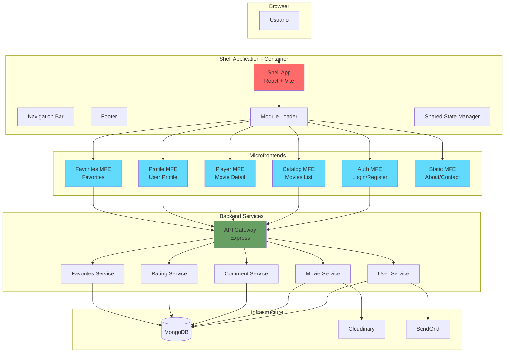

# STREAMIA - Plataforma de Streaming con Microfrontends

## Tabla de Contenidos

1. [Descripción General](#descripción-general)
2. [Arquitectura de Microfrontends](#arquitectura-de-microfrontends)
3. [Estructura del Proyecto](#estructura-del-proyecto)
4. [Desarrollo Local](#desarrollo-local)
5. [Stack Tecnológico](#stack-tecnológico)

---

## Descripción General

STREAMIA es una plataforma de streaming de películas construida con una arquitectura de microfrontends. Este proyecto es la **migración a microfrontends** del proyecto monolítico original [streamia-client](https://github.com/emanuelrivas243/streamia-client).

El proyecto permite a los usuarios explorar, reproducir y gestionar sus películas favoritas, con funcionalidades de autenticación, calificaciones y comentarios.

### Características Principales

- Autenticación y autorización de usuarios
- Catálogo de películas con búsqueda y filtros
- Reproducción de contenido con subtítulos
- Sistema de favoritos y calificaciones
- Gestión de perfil de usuario
- Comentarios y reviews

---

## Arquitectura de Microfrontends

STREAMIA utiliza Module Federation para implementar una arquitectura de microfrontends, permitiendo el desarrollo, despliegue y escalamiento independiente de cada módulo.

### Diagrama de Arquitectura



### Microfrontends Implementados

**Shell Application (Container)**
- Orquestador principal de la aplicación
- Gestión de navegación global (NavBar, Footer)
- Carga dinámica de microfrontends
- Gestión de estado compartido de autenticación
- Puerto: 3000

**Auth Microfrontend**
- Gestión de autenticación y autorización
- Login, registro, recuperación de contraseña
- Validación de formularios con Zod
- Puerto: 3001

**Shared Package**
- Componentes compartidos
- Utilidades comunes (logger, token manager)
- Tipos TypeScript compartidos
- Sistema de eventos (EventBus)
- Estilos globales (variables, mixins)

### Patrón de Integración

Module Federation permite:
- Carga dinámica de microfrontends
- Compartir dependencias comunes (React, React Router)
- Despliegue independiente de cada módulo
- Versionado individual

---

## Estructura del Proyecto

```
streamia/
├── packages/
│   ├── shell/                  # Aplicación contenedora
│   │   ├── src/
│   │   │   ├── components/     # NavBar, Footer, Layout
│   │   │   ├── router/         # Configuración de rutas
│   │   │   ├── store/          # Estado compartido
│   │   │   ├── config/         # Configuración de MFEs
│   │   │   └── App.tsx
│   │   ├── vite.config.ts
│   │   └── package.json
│   │
│   ├── auth-mfe/               # Microfrontend de autenticación
│   │   ├── src/
│   │   │   ├── components/     # LoginForm, RegisterForm
│   │   │   ├── services/       # authService
│   │   │   ├── schemas/        # Validaciones Zod
│   │   │   └── App.tsx
│   │   ├── vite.config.ts
│   │   ├── vercel.json
│   │   └── package.json
│   │
│   └── shared/                 # Código compartido
│       ├── src/
│       │   ├── events/         # EventBus
│       │   ├── types/          # Tipos TypeScript
│       │   ├── utils/          # Utilidades
│       │   ├── components/     # Componentes reutilizables
│       │   └── styles/         # Estilos globales
│       └── package.json
│
├── package.json                # Workspace root
└── README.md
```

---

## Desarrollo Local

### Requisitos
- Node.js 18+
- npm o yarn

### Instalación

```bash
# Clonar el repositorio
git clone <repository-url>
cd streamia

# Instalar dependencias
npm install

# Iniciar todos los microfrontends en desarrollo
npm run dev

# O iniciar individualmente
npm run dev:shell    # Puerto 3000
npm run dev:auth     # Puerto 3001
```

### Scripts Disponibles

```bash
npm run dev          # Inicia shell y auth-mfe en paralelo
npm run dev:shell    # Inicia solo el shell
npm run dev:auth     # Inicia solo auth-mfe
```

---

## Stack Tecnológico

### Frontend
- **React** 19.2.0 - Librería de UI
- **TypeScript** 5.9.3 - Tipado estático
- **Vite** 7.1.9 - Build tool y dev server
- **React Router DOM** 7.9.4 - Enrutamiento
- **Sass** 1.93.2 - Preprocesador CSS

### Microfrontends
- **Module Federation** (@originjs/vite-plugin-federation) - Integración de MFEs
- **Zod** - Validación de esquemas

### Utilidades
- **Lucide React** - Iconos
- **EventBus** - Comunicación entre MFEs
- **Token Manager** - Gestión de autenticación

### DevOps
- **npm workspaces** - Gestión de monorepo
- **Concurrently** - Ejecución paralela de scripts

### Backend (separado)
- Node.js + Express
- MongoDB
- JWT para autenticación
