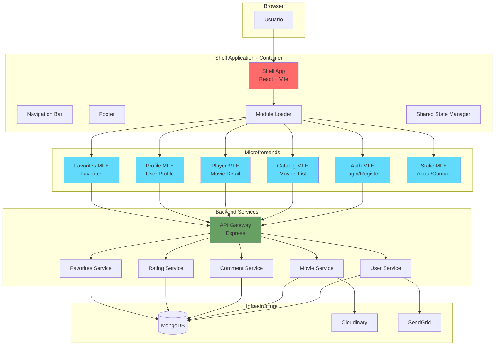

# STREAMIA - Plataforma de Streaming con Microfrontends

## Tabla de Contenidos

1. [Descripción General](#descripción-general)
2. [Arquitectura de Microfrontends](#arquitectura-de-microfrontends)
3. [Estructura del Proyecto](#estructura-del-proyecto)
4. [Desarrollo Local](#desarrollo-local)
5. [Crear un Nuevo Microfrontend](#crear-un-nuevo-microfrontend)
6. [Stack Tecnológico](#stack-tecnológico)

---

## Descripción General

STREAMIA es una plataforma de streaming de películas construida con una arquitectura de microfrontends. Este proyecto es la **migración a microfrontends** del proyecto monolítico original [streamia-client](https://github.com/emanuelrivas243/streamia-client).

El proyecto permite a los usuarios explorar, reproducir y gestionar sus películas favoritas, con funcionalidades de autenticación, calificaciones y comentarios.

### Características Principales

- Autenticación y autorización de usuarios
- Catálogo de películas con búsqueda y filtros
- Reproducción de contenido con subtítulos
- Sistema de favoritos y calificaciones
- Gestión de perfil de usuario
- Comentarios y reviews

---

## Arquitectura de Microfrontends

STREAMIA utiliza Module Federation para implementar una arquitectura de microfrontends, permitiendo el desarrollo, despliegue y escalamiento independiente de cada módulo.

### Diagrama de Arquitectura



### Microfrontends Implementados

**Shell Application (Container)**
- Orquestador principal de la aplicación
- Gestión de navegación global (NavBar, Footer)
- Layout compartido para todos los MFEs
- Carga dinámica de microfrontends
- Gestión de estado compartido de autenticación
- Puerto: 3000

**Auth Microfrontend (Auth-MFE)**
- Gestión de autenticación y autorización
- Login, registro, recuperación de contraseña
- Validación de formularios con Zod
- Renderizado condicional basado en ruta
- Puerto: 3001 (preview mode)

**Static Microfrontend (Static-MFE)**
- Páginas estáticas (Home, About, Contact)
- Manual de usuario con navegación por secciones
- Mapa del sitio con estructura recursiva
- Componente BreadcrumbNav compartido
- Puerto: 3006 (preview mode)

**Shared Package**
- Componentes compartidos entre MFEs
- Utilidades comunes (logger, token manager)
- Tipos TypeScript compartidos
- Sistema de eventos (EventBus)
- Estilos globales (variables, mixins, globals)

### Patrón de Integración

Module Federation permite:
- Carga dinámica de microfrontends
- Compartir dependencias comunes (React, React Router)
- Despliegue independiente de cada módulo
- Versionado individual

---

## Estructura del Proyecto

```
streamia/
├── packages/
│   ├── shell/                  # Aplicación contenedora (Puerto 3000)
│   │   ├── src/
│   │   │   ├── components/     # NavBar, Footer, Layout, ProtectedRoute
│   │   │   ├── router/         # AppRouter - Configuración de rutas
│   │   │   ├── store/          # SharedStore - Estado compartido
│   │   │   ├── config/         # microfrontends.ts - Config de MFEs
│   │   │   ├── styles/         # Estilos específicos de shell
│   │   │   └── App.tsx
│   │   ├── vite.config.ts      # Module Federation config
│   │   └── package.json
│   │
│   ├── auth-mfe/               # Microfrontend de autenticación (Puerto 3001)
│   │   ├── src/
│   │   │   ├── components/     # LoginForm, RegisterForm
│   │   │   ├── pages/          # LoginPage, RegisterPage, etc.
│   │   │   ├── services/       # authService
│   │   │   ├── schemas/        # authSchemas - Validaciones Zod
│   │   │   ├── styles/         # Estilos de autenticación
│   │   │   └── App.tsx         # Renderizado condicional por ruta
│   │   ├── vite.config.ts      # Expone App via Module Federation
│   │   └── package.json
│   │
│   ├── static-mfe/             # Microfrontend de páginas estáticas (Puerto 3006)
│   │   ├── src/
│   │   │   ├── components/     # BreadcrumbNav, Features
│   │   │   ├── pages/          # HomePage, AboutPage, ContactPage, etc.
│   │   │   ├── types/          # ManualSection, SitemapItem
│   │   │   ├── styles/         # Estilos de páginas estáticas
│   │   │   └── App.tsx         # Routes para páginas estáticas
│   │   ├── vite.config.ts      # Expone App y páginas via Module Federation
│   │   └── package.json
│   │
│   └── shared/                 # Código compartido entre MFEs
│       ├── src/
│       │   ├── events/         # EventBus para comunicación entre MFEs
│       │   ├── types/          # Tipos TypeScript compartidos
│       │   ├── utils/          # logger, tokenManager
│       │   ├── components/     # Componentes reutilizables (future)
│       │   └── styles/         # _variables, _mixins, _globals
│       └── package.json
│
├── start-dev.sh                # Script de desarrollo automático
├── package.json                # Workspace root con npm workspaces
└── README.md
```

---

## Desarrollo Local

### Requisitos
- Node.js 18+
- npm o yarn
- Puertos disponibles: 3000 (shell), 3001 (auth-mfe), 3006 (static-mfe)

### Instalación

```bash
# Clonar el repositorio
git clone <repository-url>
cd streamia

# Instalar dependencias de todos los paquetes
npm install
```

### Iniciar el Proyecto

**Nota importante**: Debido a que `@originjs/vite-plugin-federation` no genera correctamente `remoteEntry.js` en modo desarrollo, los microfrontends deben ejecutarse en modo **build + preview**.

```bash
# Iniciar todo el proyecto (recomendado)
npm run dev
```

Este comando ejecuta `start-dev.sh` que automáticamente:
1. Limpia procesos previos de Vite
2. Limpia las carpetas `dist/` de los MFEs
3. Construye Auth-MFE y Static-MFE
4. Inicia servidores de preview para ambos MFEs (puertos 3001 y 3006)
5. Inicia el Shell en modo desarrollo (puerto 3000)

### URLs de Acceso

- **Shell Principal**: http://localhost:3000
- **Auth MFE** (standalone): http://localhost:3001
- **Static MFE** (standalone): http://localhost:3006

### Modo de Desarrollo

El Shell (puerto 3000) corre en modo `vite dev` y carga dinámicamente los microfrontends remotos desde sus servidores de preview. Esto permite:
- Hot Module Replacement (HMR) en el Shell
- Los cambios en MFEs requieren rebuild (`npm run build` en el MFE específico)

### Scripts Disponibles

```bash
# Desarrollo completo (usa start-dev.sh)
npm run dev

# Construir todos los paquetes
npm run build

# Limpiar node_modules y reinstalar
npm run clean:install

# Scripts individuales por paquete
npm run dev -w shell       # Solo shell en dev mode
npm run build -w auth-mfe  # Solo build de auth-mfe
npm run preview -w static-mfe  # Solo preview de static-mfe
```

### Troubleshooting

**Error: "Failed to fetch dynamically imported module"**
- Asegúrate de que los MFEs estén construidos (`npm run build` en cada MFE)
- Verifica que los servidores de preview estén corriendo en los puertos correctos

**Error: "Port already in use"**
- Detén los procesos: `pkill -f vite`
- Vuelve a ejecutar `npm run dev`

**Los cambios en MFEs no se reflejan**
- Reconstruye el MFE específico: `cd packages/auth-mfe && npm run build`
- El navegador cargará automáticamente la nueva versión

---

## Crear un Nuevo Microfrontend

Esta guía te ayudará a crear e integrar un nuevo microfrontend en el proyecto Streamia.

### Paso 1: Crear la Estructura Base

```bash
# Desde la raíz del proyecto
cd packages

# Crear carpeta para el nuevo MFE (ejemplo: movies-mfe)
mkdir movies-mfe
cd movies-mfe

# Inicializar package.json
npm init -y
```

### Paso 2: Configurar package.json

Edita `packages/movies-mfe/package.json`:

```json
{
  "name": "@streamia/movies-mfe",
  "version": "1.0.0",
  "type": "module",
  "scripts": {
    "dev": "vite",
    "build": "vite build",
    "preview": "vite preview --port 3002"
  },
  "dependencies": {
    "react": "^19.2.0",
    "react-dom": "^19.2.0",
    "react-router-dom": "^7.9.4",
    "@streamia/shared": "workspace:*"
  },
  "devDependencies": {
    "@originjs/vite-plugin-federation": "^1.3.5",
    "@types/react": "^19.0.12",
    "@types/react-dom": "^19.0.4",
    "@vitejs/plugin-react": "^4.3.4",
    "sass": "^1.93.2",
    "typescript": "^5.9.3",
    "vite": "^7.1.9"
  }
}
```

### Paso 3: Configurar Vite con Module Federation

Crea `packages/movies-mfe/vite.config.ts`:

```typescript
import { defineConfig } from 'vite';
import react from '@vitejs/plugin-react';
import federation from '@originjs/vite-plugin-federation';

export default defineConfig({
  plugins: [
    react(),
    federation({
      name: 'moviesMFE',
      filename: 'remoteEntry.js',
      exposes: {
        './App': './src/App.tsx',
        // Expón otros componentes si es necesario
        // './MovieList': './src/components/MovieList.tsx',
      },
      shared: {
        react: { singleton: true },
        'react-dom': { singleton: true },
        'react-router-dom': { singleton: true },
      },
    }),
  ],
  build: {
    target: 'esnext',
    minify: false,
    cssCodeSplit: false,
  },
  server: {
    port: 3002,  // Puerto único para este MFE
  },
  preview: {
    port: 3002,
  },
});
```

### Paso 4: Configurar TypeScript

Crea `packages/movies-mfe/tsconfig.json`:

```json
{
  "compilerOptions": {
    "target": "ES2020",
    "useDefineForClassFields": true,
    "lib": ["ES2020", "DOM", "DOM.Iterable"],
    "module": "ESNext",
    "skipLibCheck": true,
    "moduleResolution": "bundler",
    "allowImportingTsExtensions": true,
    "resolveJsonModule": true,
    "isolatedModules": true,
    "noEmit": true,
    "jsx": "react-jsx",
    "strict": true,
    "noUnusedLocals": true,
    "noUnusedParameters": true,
    "noFallthroughCasesInSwitch": true
  },
  "include": ["src"],
  "references": [{ "path": "./tsconfig.node.json" }]
}
```

### Paso 5: Crear Estructura de Archivos

```bash
mkdir -p src/{components,pages,services,styles}
touch src/App.tsx src/main.tsx src/vite-env.d.ts
touch index.html
```

### Paso 6: Implementar App.tsx

**Opción A: Con React Router (para MFEs con múltiples páginas)**

```typescript
// packages/movies-mfe/src/App.tsx
import { Routes, Route } from 'react-router-dom';
import { MoviesListPage } from './pages/MoviesListPage';
import { MovieDetailPage } from './pages/MovieDetailPage';

function App() {
  return (
    <Routes>
      <Route path="/" element={<MoviesListPage />} />
      <Route path="/:id" element={<MovieDetailPage />} />
    </Routes>
  );
}

export default App;
```

**Opción B: Renderizado Condicional (para MFEs simples)**

```typescript
// packages/movies-mfe/src/App.tsx
import { useLocation } from 'react-router-dom';
import { MoviesListPage } from './pages/MoviesListPage';
import { MovieDetailPage } from './pages/MovieDetailPage';

function App() {
  const location = useLocation();
  
  if (location.pathname.match(/^\/movies\/\d+$/)) {
    return <MovieDetailPage />;
  }
  
  return <MoviesListPage />;
}

export default App;
```

### Paso 7: Crear main.tsx (para modo standalone)

```typescript
// packages/movies-mfe/src/main.tsx
import React from 'react';
import { createRoot } from 'react-dom/client';
import { BrowserRouter } from 'react-router-dom';
import App from './App';
import './styles/app.scss';

// Solo montar router si hay un elemento root (modo standalone)
const root = document.getElementById('root');
if (root) {
  createRoot(root).render(
    <React.StrictMode>
      <BrowserRouter>
        <App />
      </BrowserRouter>
    </React.StrictMode>
  );
}
```

### Paso 8: Crear index.html

```html
<!DOCTYPE html>
<html lang="es">
  <head>
    <meta charset="UTF-8" />
    <meta name="viewport" content="width=device-width, initial-scale=1.0" />
    <title>Movies MFE</title>
  </head>
  <body>
    <div id="root"></div>
    <script type="module" src="/src/main.tsx"></script>
  </body>
</html>
```

### Paso 9: Configurar el Shell para Cargar el Nuevo MFE

**9.1. Actualizar vite.config.ts del Shell**

```typescript
// packages/shell/vite.config.ts
export default defineConfig({
  plugins: [
    react(),
    federation({
      name: 'shell',
      remotes: {
        authMFE: 'http://localhost:3001/assets/remoteEntry.js',
        staticMFE: 'http://localhost:3006/assets/remoteEntry.js',
        moviesMFE: 'http://localhost:3002/assets/remoteEntry.js',  // Nuevo
      },
      shared: {
        react: { singleton: true },
        'react-dom': { singleton: true },
        'react-router-dom': { singleton: true },
      },
    }),
  ],
  // ...
});
```

**9.2. Actualizar TypeScript declarations**

```typescript
// packages/shell/src/vite-env.d.ts
declare module 'authMFE/App' {
  const App: React.ComponentType;
  export default App;
}

declare module 'staticMFE/App' {
  const App: React.ComponentType;
  export default App;
}

declare module 'moviesMFE/App' {
  const App: React.ComponentType;
  export default App;
}
```

**9.3. Agregar rutas en AppRouter**

```typescript
// packages/shell/src/router/AppRouter.tsx
const MoviesMFE = loadMicrofrontend(
  () => import('moviesMFE/App'),
  'Movies MFE'
);

// Dentro de <Routes>
<Route path="/movies/*" element={<MoviesMFE />} />
```

### Paso 10: Actualizar start-dev.sh

```bash
# Agregar build del nuevo MFE
echo "Building Movies MFE..."
cd packages/movies-mfe
npm run build
cd ../..

# Agregar preview del nuevo MFE
cd packages/movies-mfe
npm run preview > ../../logs/movies-mfe.log 2>&1 &
cd ../..
```

### Paso 11: Instalar y Probar

```bash
# Desde la raíz del proyecto
npm install

# Iniciar todo
npm run dev
```

Accede a http://localhost:3000/movies para ver tu nuevo microfrontend integrado.

### Checklist de Integración

- [ ] package.json creado con nombre `@streamia/[nombre]-mfe`
- [ ] vite.config.ts con Module Federation configurado
- [ ] Puerto único asignado (no conflictos)
- [ ] App.tsx exportado correctamente
- [ ] Shell actualizado (vite.config.ts, vite-env.d.ts, AppRouter.tsx)
- [ ] start-dev.sh actualizado con build y preview
- [ ] Rutas del MFE probadas en modo standalone
- [ ] Rutas del MFE probadas en el shell
- [ ] Estilos no conflictivos con otros MFEs

### Buenas Prácticas

1. **Aislamiento de Estilos**: Usa clases CSS con prefijos únicos o CSS Modules
2. **Compartir Dependencias**: Usa `@streamia/shared` para código común
3. **Logging**: Implementa logging con `createLogger` de shared
4. **Tipos**: Define y exporta tipos TypeScript en `src/types/`
5. **Servicios**: Separa lógica de API en `src/services/`
6. **No Wrappers**: El MFE no debe tener su propio Layout, el Shell lo provee
7. **Rutas Relativas o Condicionales**: Evita rutas absolutas en Routes del MFE

---

## Stack Tecnológico

### Frontend Core
- **React** 19.2.0 - Librería de UI
- **TypeScript** 5.9.3 - Tipado estático
- **Vite** 7.2.4 - Build tool y dev server ultra-rápido
- **React Router DOM** 7.9.4 - Enrutamiento (singleton compartido)
- **Sass** 1.93.2 - Preprocesador CSS con variables y mixins

### Arquitectura de Microfrontends
- **@originjs/vite-plugin-federation** 1.3.5 - Module Federation para Vite
- **npm workspaces** - Gestión de monorepo
- **Shared Package** - Código compartido entre MFEs

### Validación y Formularios
- **Zod** 3.24.1 - Validación de esquemas TypeScript-first

### UI y Estilos
- **Lucide React** - Iconos modernos y ligeros
- **CSS Modules / SCSS** - Estilos con scoping

### Utilidades Compartidas
- **EventBus** - Sistema de eventos para comunicación entre MFEs
- **Token Manager** - Gestión centralizada de tokens JWT
- **Logger** - Sistema de logging con colores y niveles

### Desarrollo
- **start-dev.sh** - Script automatizado para desarrollo
- **ESLint** - Linting de código
- **Hot Module Replacement** - HMR en Shell

### Backend (Repositorio Separado)
- Node.js + Express
- MongoDB
- JWT para autenticación
- Cloudinary para almacenamiento de media
- SendGrid para emails

---

## Contribución

Para contribuir al proyecto:

1. Fork el repositorio
2. Crea una rama para tu feature (`git checkout -b feature/amazing-feature`)
3. Commit tus cambios (`git commit -m 'Add amazing feature'`)
4. Push a la rama (`git push origin feature/amazing-feature`)
5. Abre un Pull Request

## Licencia

Este proyecto es parte de un trabajo académico para la materia Desarrollo de Software III.

## Contacto

- Repositorio Original (monolito): [streamia-client](https://github.com/emanuelrivas243/streamia-client)
- Backend: [Repositorio separado del backend]

---

